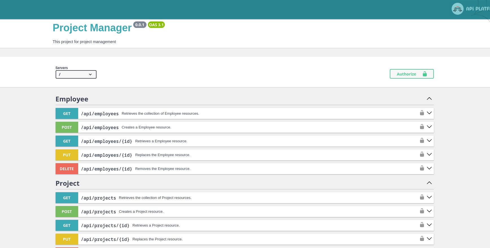

# Project Manager





## Installation

Run docker containers

```bash
  docker compose up -d
```

Install composer scripts:
```bash
  docker compose exec php composer install
```

To install project run command:
```bash
  docker compose exec php bin/console ask:install
```

**Done! You can open <a href="http://localhost:8511/api" target="_blank">http://localhost:8507/api</a> via browser. 
By the way, you can change this port by changing ```DOCKER_NGINX_PORT``` variable in [.env](.env) file.** 

JWT keys
For use Json Web Token system you must create private and public keys. 
They are have already created when you install project. You can re-create them with:<br>  
```bin/console ask:generate:jwtKeys```